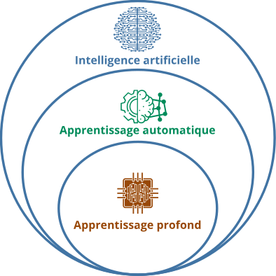
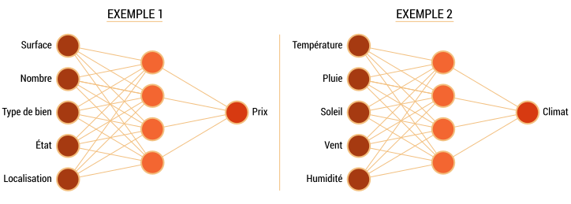
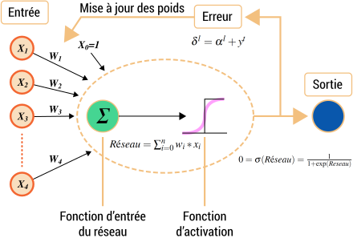
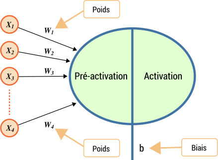
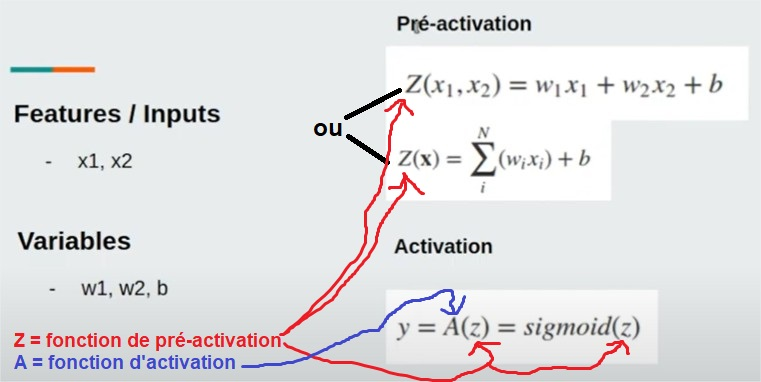
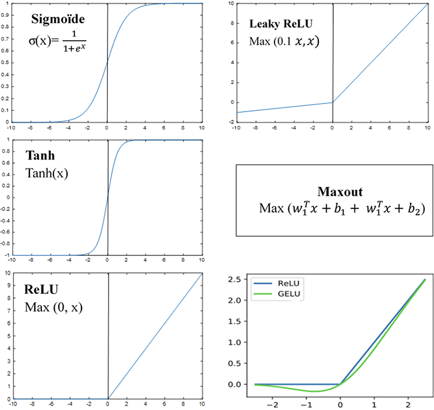
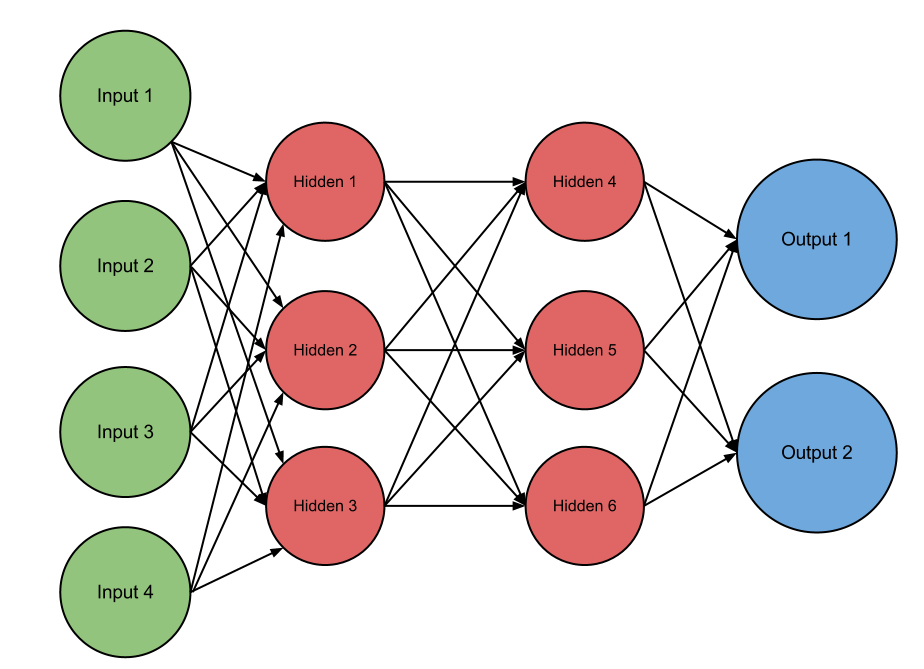
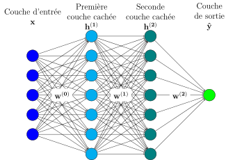
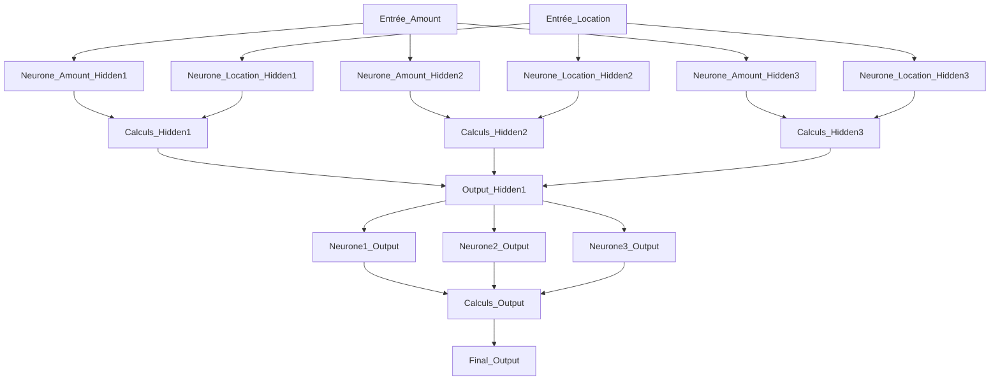

# Notion de bases sur l'IA

## Différences

### Intelligence Artificielle

La **Intelligence Artificielle** (IA) représente un processus où un ordinateur imite le comportement humain pour résoudre des tâches, comprenant, apprenant, raisonnant et prenant des décisions.

### Apprentissage Automatique

L'**Apprentissage Automatique** (AA) en intelligence artificielle consiste à développer des algorithmes permettant à un système informatique d'apprendre à partir de données, sans programmation explicite. L'ordinateur ajuste son comportement en fonction des informations reçues.

### Apprentissage Profond

L'**Apprentissage Profond**, une catégorie spécifique de l'apprentissage automatique, utilise des réseaux de neurones artificiels profonds pour résoudre des problèmes. Contrairement à l'apprentissage automatique traditionnel, il élimine largement le besoin d'ingénierie de fonctionnalités, permettant au système d'apprendre des représentations complexes directement des données.

#### Exemple : Reconnaissance d'Images

- **Apprentissage Automatique Traditionnel :**
  - *Caractéristiques manuelles :* Forme des oreilles, couleur du pelage, taille.
  - *Règles définies :* Oreilles pointues pour les chats, pelage tigré, petite taille.

- **Apprentissage Profond :**
  - *Automatisation :* Le modèle apprend automatiquement des motifs complexes des images brutes.
  - *Représentations autonomes :* Identification des contours, textures, motifs sans spécification préalable.

L'apprentissage profond automatisant l'identification de motifs complexes dans la reconnaissance d'images, il élimine le besoin de spécifications manuelles. En revanche, l'apprentissage automatique traditionnel exige une intervention humaine pour définir des caractéristiques spécifiques, le rendant moins flexible.

### Apprentissage Supervisé

Dans le cadre de l'apprentissage supervisé, on distingue des données en entrée (inputs/features) et le résultat attendu (label). Ce mode d'apprentissage nous permet de faire des prédictions basées sur un modèle obtenu à partir d'un historique. On est amené à résoudre deux problèmes majeurs qui sont la classification (quelle classe ?) et la régression (combien ?).

**Exemple**: Dans un exemple d'apprentissage supervisé, prenons un ensemble de données sur des fleurs avec des caractéristiques telles que la longueur et la largeur des pétales en tant que features. Le label serait la classe de la fleur (par exemple, rose, tulipe, etc.). Le modèle apprendrait à prédire la classe d'une fleur en se basant sur ces caractéristiques.

### Apprentissage Non Supervisé

L'apprentissage non supervisé est basé seulement sur des features et il n'y a pas la notion de label. Il sert à découvrir des structures et des modèles dans les données transmises, d'où le résultat n'est pas prédéterminé.

**Exemple**: Imaginons un ensemble de données sur des clients d'un site de commerce électronique avec des caractéristiques telles que les habitudes d'achat, la fréquence d'achat, etc. Dans ce cas, l'apprentissage non supervisé pourrait être utilisé pour découvrir des segments de clients similaires sans avoir de labels prédéfinis.

> [!NOTE]
> Qu'il s'agisse de l'apprentissage supervisé ou non supervisé, l'évaluation du modèle nécessite de fournir au préalable des exemples étiquetés pour déterminer la validité de ses prédictions. La différence entre les deux approches réside principalement dans la manière dont le modèle utilise ces exemples : soit en apprenant directement les caractéristiques, soit en se basant sur des caractéristiques prédéfinies.

### Apprentissage par Renforcement

L'apprentissage par renforcement sert à choisir une action parmi une liste d'actions et, en fonction de l'action choisie, il recevra un retour de l'environnement tout en maximisant la notion de récompense cumulative. L'agent apprend au fur et à mesure quelle stratégie (ou choix d'actions) maximise le cumul de récompenses.

**Exemple**: Considérons un agent qui apprend à jouer à un jeu vidéo. L'agent choisit des actions (comme déplacer un personnage ou effectuer une action spécifique) et reçoit des récompenses ou des pénalités en fonction de ses choix. L'objectif de l'agent est de maximiser la récompense cumulative au fil du temps, apprenant ainsi à adopter des stratégies efficaces.

## Apprentissage profond

On note que l'étape de modélisation est cruciale pour résoudre tout problème. Les réseaux de neurones artificiels, inspirés des neurones biologiques, utilisent des paramètres pour prédire une valeur, tirant profit des expériences passées.

### Architecture de Réseau de Neurones

Un réseau neuronal est un ensemble de neurones organisés en couches. Chaque neurone est une fonction mathématique qui prend son entrée, la multiplie par ses poids, puis transmet la somme à travers la fonction d’activation aux autres neurones. Le réseau neuronal apprend à classer une entrée en ajustant ses poids en fonction d’exemples précédents et en se basant sur le processus d’optimisation.

#### Neurones

Un neurone est une entité qui permet de recevoir les données d’entrée et produire une donnée en sortie. 

Un neurone est une entité fondamentale en deep learning. Sa constitution est illustrée ci-dessous:

> [!NOTE]
> "Pondérée": se réfère à quelque chose qui est affecté par un poids

1. **Entrées:** Ces entrées peuvent être des caractéristiques d'un ensemble de données, les sorties d'autres neurones. Par exemple, dans un réseau de neurones pour la classification d'images, les entrées pourraient être les pixels d'une image.

2. **Poids et biais:** Les poids et biais sont des variables du réseau dont les mises à jour servent à perfectionner la performance du réseau. Les poids sont des valeurs numériques initialisées de manière aléatoires et ajustées au fur et mesure pour améliorer la précision de l’apprentissage. Les biais sont également des valeurs numériques utilisés par une fonction de pré-activation (Plus d'informations [ici](#poids-et-biais))
   > La détermination de l'importance des poids dans un réseau de neurones est cruciale pour le processus d'apprentissage. Initialement aléatoires, les poids sont ajustés itérativement au cours de l'entraînement en utilisant des algorithmes d'optimisation tels que la rétropropagation du gradient. Ce processus vise à minimiser une fonction de perte, mesurant l'écart entre les prédictions du réseau et les valeurs réelles. Ainsi, le réseau apprend à attribuer l'importance correcte à chaque caractéristique d'entrée en se basant sur l'historique des exemples d'entraînement.

3. **Fonction de Pré-activation:** c'est la phase de préparation avant que le neurone prenne une décision. Elle ajuste l'influence de chaque entrée en fonction de son poids, réalisant ainsi une sorte de calcul de moyenne pondérée. Pour chaque neurone, la fonction de pré-activation multiplie chaque entrée par son poids, puis ajoute le biais à cette somme. Cette opération produit la pré-activation, qui est une représentation pondérée des entrées prête pour la prochaine étape du processus décisionnel du réseau neuronal.

4. **Fonction d'Activation:** c'est une fonction mathématique qui introduit de la non-linéarité en transformant le résultat de la fonction de pré-activation en déterminant la réponse finale du neurone. Différentes fonctions d'activation, telles que ReLU, sigmoïde, etc., sont utilisées, chacune ayant une forme mathématique spécifique pour déterminer l'activation du neurone (Exemples [ici](#fonction-activations))

   
   > y = probabilité
   >  tet

5. **Sortie (Output):** La sortie du neurone est le résultat final après l'application de la fonction d'activation. Dans le cas de la prédiction du prix d'une maison, la sortie pourrait représenter la valeur estimée de la maison.

<h5 id="poids-et-biais">
  Poids et biais
</h5>

**Poids (Weight):** Les poids dans un réseau de neurones sont comme des ajustements pour dire à chaque connexion entre les neurones à quel point elle est importante. Lorsque le réseau apprend, il ajuste ces poids pour obtenir les bonnes réponses pour différentes entrées, ce qui se traduit par des sorties souhaitées. L'objectif est de minimiser les erreurs grâce à une fonction de coût.

**Biais (Bias):** Le biais, d'autre part, est un paramètre supplémentaire associé à chaque neurone dans un réseau de neurones. Il est ajouté à la somme pondérée des entrées d'un neurone avant l'application de la fonction d'activation. Le biais offre au réseau une certaine flexibilité pour mieux s'adapter aux données en introduisant un décalage ou un terme constant. En d'autres termes, le biais permet au réseau de produire des sorties même lorsque toutes les entrées sont nulles.

<h5 id="fonction-activations">
  Exemples fonctions d'activations
</h5>

- **Sigmoïde :** Produit une courbe en forme de S, utilisée couramment dans la couche de sortie pour la classification binaire. Elle transforme les valeurs en un intervalle entre 0 et 1.
- **Fonctions de tangente hyperbolique (tanh) :** Similaire à la sigmoïde mais avec une plage entre -1 et 1, ce qui peut aider à gérer les problèmes de symétrie dans le modèle.
- **Unité linéaire rectifiée (ReLu) :** Utilisée dans les couches cachées, cette fonction est non linéaire et active le neurone si la somme pondérée est positive, sinon, elle produit zéro.
- **Softmax :** Utilisée dans la couche de sortie pour la classification multiclasse, elle convertit les scores en probabilités, facilitant l'interprétation des résultats.

**Initialisation et Ajustement du Biais :**

Le biais est initialement fixé à une valeur constante. Pendant l'entraînement, il est ajusté itérativement avec les poids pour minimiser une fonction de coût, permettant au modèle de s'adapter aux données. La valeur initiale du biais peut dépendre du problème, parfois initialisée à zéro ou de manière aléatoire. La descente de gradient ou un autre algorithme d'optimisation est utilisé pour ajuster les poids et le biais en fonction de l'erreur entre les prédictions du modèle et les vraies valeurs.

> Une fonction de coût, ou fonction d'erreur, mesure la différence entre les prédictions d'un modèle et les vraies 

En résumé, le biais est une composante apprise du modèle, ajustée au cours de l'entraînement avec les poids pour permettre au réseau de s'adapter aux données.

**Exemple:**

Imaginons que nous utilisons un réseau de neurones pour prédire les salaires basés sur l'expérience professionnelle. Les poids ajustent l'influence de l'expérience, mais le biais représente un salaire de base indépendamment de l'expérience. Cela permet au modèle de considérer une rémunération de base même pour ceux sans expérience. Par exemple, même si l'expérience est nulle, le biais évite que le modèle prédise un salaire nul. Ainsi, le biais ajoute de la flexibilité pour capturer des éléments constants, comme un salaire de départ, non liés aux variables spécifiques.

**Différence:**
La principale différence réside dans leur rôle dans le calcul des sorties d'un neurone. Les poids sont utilisés pour ajuster l'importance relative des différentes entrées, tandis que le biais permet d'introduire un décalage ou un terme constant dans la sortie du neurone.

- *Poids:* Ajuste l'importance des entrées.
- *Biais:* Introduit un décalage ou un terme constant.

#### Types de neurones:

Un ensemble de neurones peut être vu comme une couche (entrées, cachées ou sorties).

1. **Neurones d’entrée** : Ils reçoivent des données d’entrée, les traitent et les transmettent aux neurones dans la couche suivante.

2. **Neurones cachés** : Ils prennent les données de sortie des précédents neurones en entrée, calculent de nouvelles données de sortie et les transmettent aux couches suivantes.

3. **Neurones de de sortie** : Ils transmettent les données de sortie en entrée des neurones de la couche de sortie afin de produire les données de sortie finale.

### Couches (Ensemble de neurones)

Une couche (layer) dans un réseau de neurones correspond à un groupe de neurones ayant pour rôle de transmettre l'information à travers le réseau. Un réseau peut être composé d'au moins deux couches : une couche d'entrée et une couche de sortie. 

Les trois types de couches principales sont les couches d'entrée, les couches cachées, et les couches de sortie. Les couches autres que les couches d'entrée et de sortie sont appelées les couches cachées.

Plus la profondeur du réseau est grande (plus il y a de couches), plus on parle de deep learning.

Exemple Simple :

Considérons un réseau de neurones pour la détection de fraude par carte de crédit avec trois couches :

1. **Couche d'entrée** : Chaque neurone représente une caractéristique de la transaction (montant, lieu, etc.).
2. **Couche cachée** : Elle prend les données de sortie des neurones de la couche d'entrée, calcule de nouvelles données de sortie, et les transmet aux couches suivantes.
3. **Couche de sortie** : Elle donne la prédiction finale, par exemple, fraude ou non-fraude.

Dans cet exemple, chaque caractéristique de la transaction est une entrée pour un neurone dans la couche d'entrée, le réseau effectue des calculs dans la couche cachée, et la couche de sortie donne la prédiction finale en fonction des résultats appris pendant l'entraînement.

Cela pourrait ressembler à ceci :

