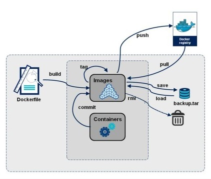

# Les namespaces :
Les namespaces permettent de créer des groupes de processus isolés du reste de la machine, c'est l'outil de base pour création des containers sous Linux. Ces namespaces permettent un bonne isolation des containers dans Docker.

- **PID :** isolation de l'espace des processus
- **UTS :** pour avoir son propre hostname
- **IPC :** qui permet d'isoler les Communications Inter-Processus
- **NET :** chaque conteneur peut avoir sa propre interface réseau, son ip, ses règles de filtrage
- **MOUNT :** monter un systeme de fichier propre au processus différent du système de fichier de la machine hôte
- **IPC :** isole les coummunications inter processus
- **USER :** mapping des UID/GID entre l'hôte et le conteneur (donne un accés root dans le conteneur sans qu'il soit root sur la machine hôte)
**CGROUPS :** fonctionnalité du noyau Linux pour limiter, compter et isoler l'utilisation des ressources (processeur, mémoire, utilisation disque, etc.) d'un processus

script pour les informations sur les namespaces d'un conteneur : https://github.com/Hajdaini/Docker/tree/master/Scripts/Bash/namespace
