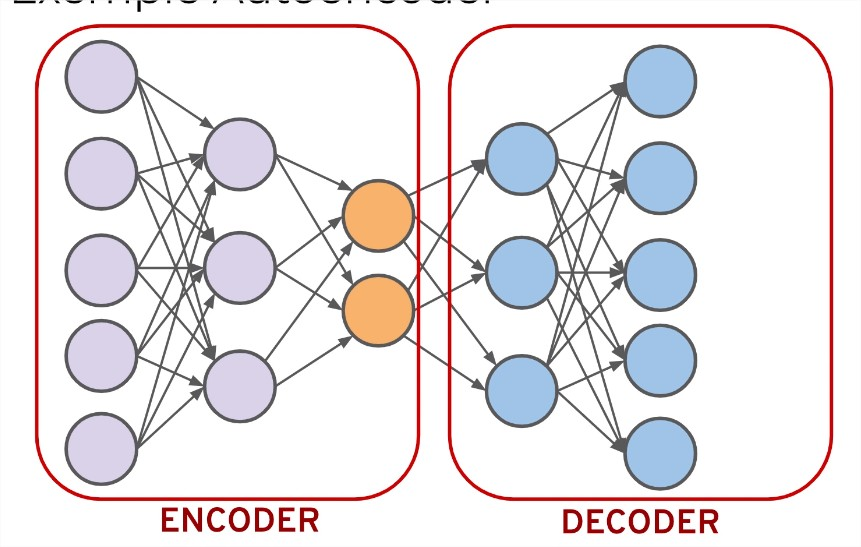
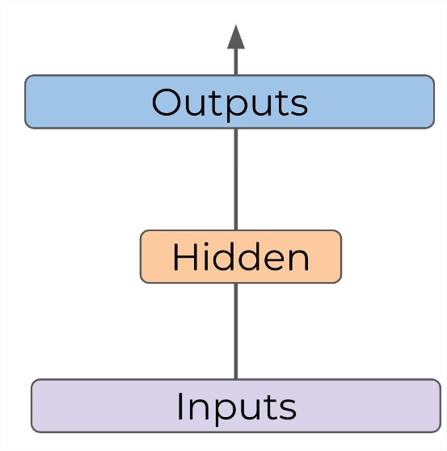

# Autoencodeurs

Nous explorerons principalement l'apprentissage non supervisé à travers l'utilisation des autoencodeurs.

## Applications des Autoencodeurs

Les autoencodeurs sont principalement utilisés pour deux applications principales :

1. **Réduction de Dimensionnalité :** Les autoencodeurs visent à apprendre une représentation comprimée ou codage d'un ensemble de données. Cette réduction de dimensionnalité peut être utile pour diverses tâches, notamment la visualisation de données et l'efficacité du modèle.

2. **Suppression du Bruit des Images :** Les autoencodeurs peuvent également être utilisés pour éliminer le bruit des images en apprenant à reconstruire une version propre de l'image à partir de sa version bruitée.

## Apprentissage Non Supervisé et Semi-Supervisé

L'utilisation des autoencodeurs relève de l'apprentissage non supervisé, où nous n'avons pas d'étiquettes correctes pour nos données lors de l'entraînement. Cependant, dans certaines situations, les autoencodeurs peuvent être considérés comme semi-supervisés, car lors de l'entraînement, nous pouvons avoir accès à des données historiques avec des étiquettes correctes.

## Caractéristiques de l'Autoencodeur

Les autoencodeurs présentent une simplicité dans leur architecture, mais leurs applications dans des domaines philosophiques et nuancés en font un sujet fascinant. Nous explorerons la structure du réseau, son architecture, ainsi que son cadre d'utilisation.

- **Entrées et Sorties :** La principale différence réside dans le fait que le nombre de neurones en entrée est égal au nombre de neurones en sortie dans un autoencodeur. Cela contraste avec les modèles classiques où ces nombres peuvent différer.

- **Réduction de Dimension :** L'idée centrale est de réduire la dimensionnalité de l'entrée vers une couche cachée, puis de la développer à nouveau vers la sortie. Cette couche cachée doit apprendre les caractéristiques importantes de l'entrée pour reproduire efficacement la sortie.

Voici un exemple d'autoencodeur :

- Entrées: 5 neurones
- Couche cachée réduisant la dimension: 3 neurones
- Couche cachée augmentant la dimension: 2 neurones
- Sorties: 5 neurones

L'idée est de réduire progressivement la dimension de l'entrée, atteindre le nombre de neurones souhaité dans la couche cachée, puis étendre à nouveau vers la sortie.

L'autoencodeur peut être utilisé pour réduire la dimensionnalité d'un ensemble de données. On entraîne l'autoencodeur, puis on divise le modèle en deux parties (codeur et décodeur). En extrayant les résultats de la couche cachée, on obtient une représentation réduite de l'ensemble de données, utile pour la visualisation.

## Suppression du Bruit des Images

Une autre application consiste à utiliser l'autoencodeur pour supprimer le bruit des images. La couche cachée apprend à filtrer le bruit lors de la reproduction des sorties, offrant une version propre de l'image.

Ces deux applications utilisent la même architecture d'autoencodeur mais de manière différente, illustrant la flexibilité de cette structure pour différentes tâches.

## Cas d'Utilisation de la Réduction de Dimension

La réduction de dimensionnalité présente diverses applications :
1. **Compression des Données :** Peut être utilisée pour comprimer un ensemble de données.
2. **Visualisation des Données :** Utile pour visualiser des données dans des dimensions inférieures.
3. **Révélation de Relations Cachées :** Peut révéler des relations non clairement visibles dans des dimensions supérieures.

## Exemple de Réduction de Dimension

La réduction de dimension est particulièrement utile lorsque l'on travaille avec des ensembles de données comportant plus de trois dimensions. Visualiser ces données peut être complexe, et la réduction de dimension offre une solution. Par exemple, si nous partons de trois dimensions et visualisons les résultats en 2D, nous pouvons mieux comprendre la séparation des classes.

 [Insérer un lien ou une image ici]

La capacité à réduire la dimensionnalité est cruciale pour saisir des relations subtiles entre les données et pour améliorer la compréhension globale de l'ensemble de données.

Dans les prochaines vidéos, nous passerons à la mise en pratique en codant un exemple concret d'autoencodeur pour la réduction de dimension.