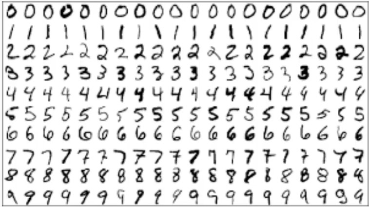
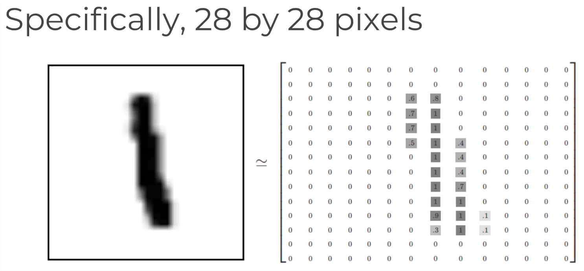
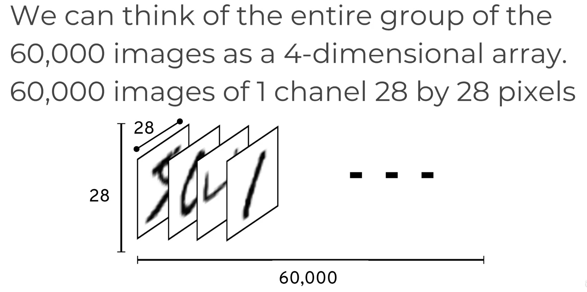
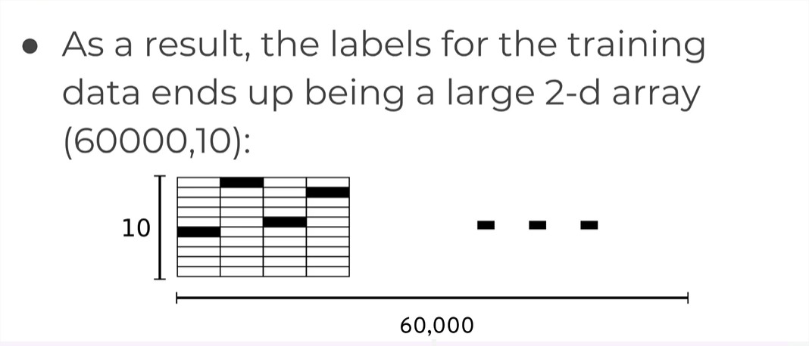
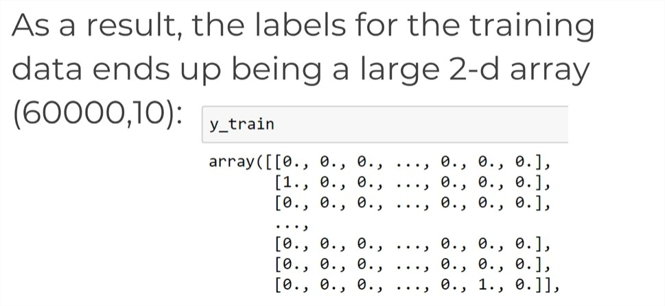

# Jeu de données MNIST et Réseaux de Neurones Convolutifs avec Keras

## Introduction

Dans cette leçon, nous allons explorer le jeu de données MNIST, un ensemble de données largement reconnu dans le domaine des réseaux de neurones convolutifs (CNN) et de l'apprentissage en profondeur. Le jeu de données MNIST comprend 60 000 images d'entraînement et 10 000 images de test, chacune représentant des chiffres manuscrits de 0 à 9. 



Nous allons examiner la structure du jeu de données, qui implique la représentation des images (grayscale) sous forme de tableaux:



## Accès à MNIST avec Keras

L'accès au jeu de données MNIST est simple avec Keras, en utilisant une fonction qui est déjà intégrée. Le jeu de données se compose d'images en niveaux de gris de 28x28 pixels, avec des valeurs de pixels normalisées comprises entre 0 et 1. Chaque image est représentée sous forme de tableau à quatre dimensions, en tenant compte des dimensions pour les échantillons, les canaux de couleur, et les axes X et Y.



soit 

```
(60000, 28, 28, 1)
(Samples, x, y, channels)
```

> Pour les images couleur, la dernière valeur de dimension serait 3 (RGB)

## Étiquettes et encodage one-hot

Les étiquettes dans le jeu de données MNIST sont initialement fournies sous forme d'une liste de nombres représentant le chiffre dessiné. Pour entraîner un réseau neuronal, nous effectuons un encodage one-hot sur ces étiquettes. 

L'encodage one-hot consiste à créer un tableau binaire pour chaque étiquette, où l'index du chiffre est marqué comme 1 et les autres sont 0. Cela est particulièrement utile pour les réseaux neuronaux avec une sortie à une seule couche.

**Exemple d'encodage one-hot**

Par exemple, si un chiffre est 4, son tableau d'étiquettes aurait un 1 à l'index 4 et des zéros ailleurs. Cela garantit la compatibilité avec une couche de sortie à 10 neurones, où chaque neurone correspond à un chiffre de 0 à 9.

```
[0, 0, 0, 0, 1, 0, 0 ,0 ,0, 0] => 4
```
## Transformation des données

La transformation des étiquettes en encodage one-hot donne un grand tableau 2D pour les données d'entraînement, avec des dimensions de 60 000 par 10. Chaque ligne représente l'étiquette encodée en one-hot pour une image respective.






## Application des CNN avec Keras

Maintenant équipés d'une compréhension du jeu de données MNIST et de l'encodage one-hot, nous sommes prêts à appliquer des réseaux de neurones convolutifs avec Keras sur ce jeu de données. Restez à l'écoute pour la section pratique de codage dans la prochaine leçon.
