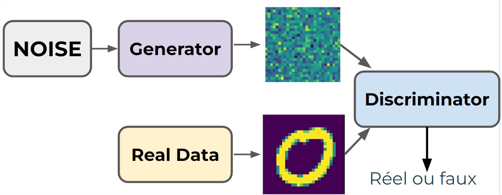
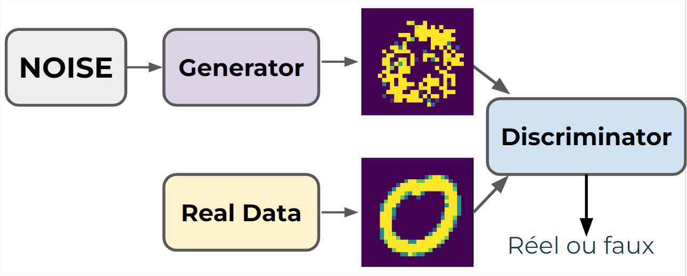
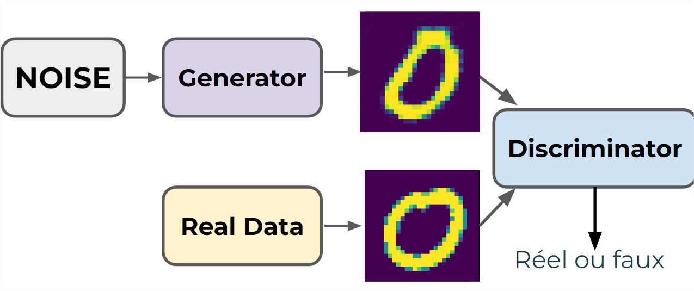

- [Structure des GANs](#structure-des-gans)
- [Phases d'Entraînement](#phases-dentra%C3%AEnement)
    - [Phase 1 - Entraînement du Discriminateur](#phase-1---entra%C3%AEnement-du-discriminateur)
    - [Phase 2 - Entraînement du Générateur](#phase-2---entra%C3%AEnement-du-g%C3%A9n%C3%A9rateur)
- [Défis des GANs](#d%C3%A9fis-des-gans)
- [Solutions Potentielles](#solutions-potentielles)
- [Remarques Finales](#remarques-finales)

# Réseaux Génératifs Adverses (GANs)

Les Réseaux Génératifs Adverses, abrégés en GANs (Generative Adversarial Networks), ont été introduits en 2014 par Ian Goodfellow et ses collègues chercheurs. Ce concept repose sur l'idée d'utiliser deux réseaux en compétition pour générer de nouvelles données inconnues.

## Structure des GANs

> Les GANs sont souvent utilisés pour générer des données d'image, mais leur application peut être étendue.

sLes GANs se composent de deux parties :
- **Générateur (Contrefacteur) :** Produit de nouvelles données à partir d'un bruit aléatoire (distribution gaussienne).
- **Discriminateur (Détective) :** Classe les données en réelles ou générées par le générateur.

## Phases d'Entraînement

### Phase 1 - Entraînement du Discriminateur

Dans la première phase d'entraînement des GANs, le discriminateur est mis à l'épreuve pour distinguer entre les images réelles et les images générées par le générateur. Voici comment cela se déroule :

1. **Combinaison des Images :** Les images réelles sont considérées comme une seule et même image. Ces images sont ensuite combinées avec les fausses images générées par le générateur.
2. **Étiquetage des Images :** Les images réelles sont étiquetées comme 1, tandis que les fausses images générées par le générateur sont étiquetées comme 0.
3. **Optimisation du Discriminateur :** Pendant cette phase, la propagation en arrière (backpropagation) et l'optimisation des poids se font uniquement pour le discriminateur. Il apprend ainsi à distinguer entre les images réelles et les fausses images.

### Phase 2 - Entraînement du Générateur

La deuxième phase d'entraînement est centrée sur l'amélioration du générateur en réponse aux retours du discriminateur :

1. **Étiquetage des Fausses Images :** Les fausses images générées par le générateur sont étiquetées comme 1, faisant croire au générateur qu'elles sont réelles.
2. **Rétropropagation sur les Poids du Générateur :** Pendant cette phase, seule la rétropropagation sur les poids du générateur est effectuée. Contrairement à la phase 1, où la rétropropagation se faisait sur les poids du discriminateur.
3. **Générateur sans Accès aux Vraies Images :** Il est crucial de noter que le générateur n'a jamais accès aux vraies images. Il produit des images convaincantes uniquement à partir des retours du discriminateur sur ses fausses images.
4. **Amélioration Continue :** Le discriminateur s'améliorant également au fil des phases d'entraînement, le générateur doit constamment élever son niveau pour tromper efficacement le discriminateur.

## Défis des GANs

- **Ressources d’entraînement**: nécessitent un GPU pour son ton temps d’entraînement.
- **Effondrement du Mode :** Souvent, le générateur trouve quelques images (ou une seule image) qui peuvent tromper le discriminateur, et finit par "s'effondrer" pour ne produire que cette image.
- **Instabilité :** Il peut être difficile de déterminer les performances et les périodes d'entraînement appropriées puisque les images générées sont toujours vraiment "fausses". Ce qui provoque des difficultés à évaluer les performances réelles et à déterminer les hyperparamètres appropriés.

## Solutions Potentielles

- **Utilisation de GANs à Convolution Profonde :** Les GANs à convolution profonde peuvent aider à éviter l'effondrement du mode.
- **Discrimination par Mini Batch :** Punit les lots d'images générées trop similaires.
- **Expérimentation avec les Hyperparamètres :** Ajustement du nombre d'activation des neurones, taux d'apprentissage, etc.
