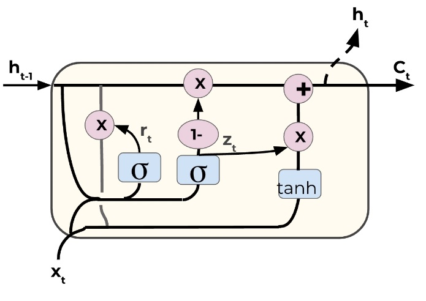

# NLP

Cette section est dédiée au traitement du langage naturel (NLP) avec le deep learning. Nous allons explorer comment travailler avec des données textuelles en relation avec les RNN que nous avons récemment abordés.

## Objectif

Notre objectif est de construire un réseau de neurones capable de générer du texte basé sur un corpus existant. Nous utiliserons les œuvres complètes de William Shakespeare comme exemple, permettant au réseau d'apprendre la structure et le style d'écriture.

## Étapes du Projet

1. **Lecture des Données Textuelles:** Utilisation des commandes Python de base pour lire un corpus de données textuelles.

2. **Traitement Textuel et Vectorisation:** Les données textuelles doivent être encodées en entiers, car les réseaux de neurones ne traitent pas les chaînes brutes. Chaque caractère, y compris la ponctuation et les espaces, sera représenté par un index (ex: "A: 1", "B: 2", etc.). 

3. **Création de Lots (Batches):** Utilisation de l'objet dataset de TensorFlow pour créer des lots de séquences de texte, facilitant ainsi l'apprentissage du réseau (ex: ["h", "e", "l", "l", "o"] -> ["e", "l", "l", "o", "m", "y]). Nous voudrons utiliser des séquences suffisamment longues pour saisir le contexte, mais pas trop longues pour éviter les problèmes de bruits historiques.

4. **Création du Modèle:** Utilisation de trois couches principales:
   - Embedding Layer: Cette couche est responsable de la traduction des entiers en vecteurs denses de taille fixe. Elle prend en entrée la taille du vocabulaire, la taille de la séquence, et la taille du vecteur d'embedding.
   - GRU Layer: c'est comme la couche LSTM, mais plus rapide à calculer avec une porte d'oublie mais il a moins de paramètres que la couche LSTM car il n'a pas de porte de sortie.
     
   - Dense Layer: un neurone par caractère. Les étiquettes sont encodées en One-Hot Encoding, de qorte que la couche dense finale produise une probabilité pour chaque caractère du vocabulaire.

5. **Entraînement du Modèle:** Mise en place des batches, encodage des étiquettes en One-Hot Encoding, et entraînement du modèle.

6. **Génération de Nouveau Texte:** Utilisation du modèle entraîné pour générer du texte, en jouant éventuellement avec la température des probabilités.

7. **Sauvegarde et Chargement des Modèles:** Apprendre à sauvegarder les poids du modèle et à les charger à nouveau avec une taille de batch différente pour la génération de texte.
