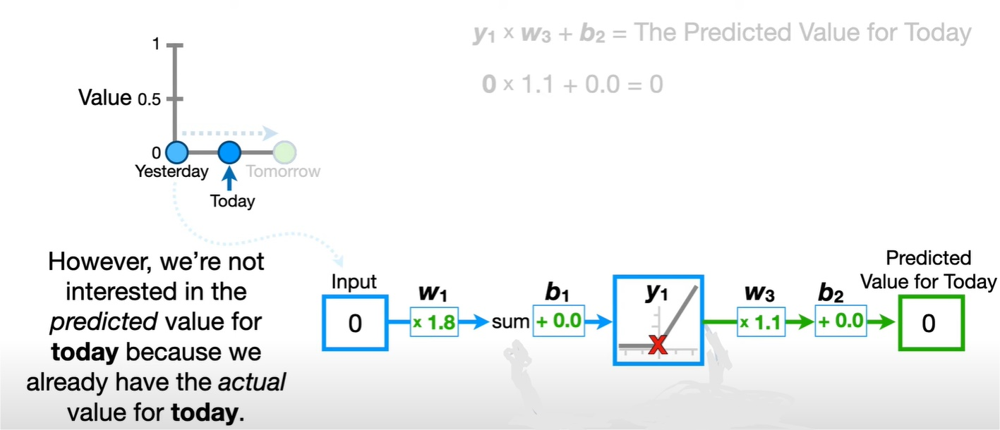

# RNN

## Introduction

Les RNN sont particulièrement adaptés au traitement de données séquentielles, où l'ordre des éléments détient une information significative. L'objectif est de prédire le future. Les exemples de données séquentielles incluent des séries temporelles, des phrases, des données audio, des trajectoires de véhicules, etc. L'ordre des éléments est crucial pour comprendre l'information dans de telles données.

## ANN vs RNN

[https://www.youtube.com/watch?v=AsNTP8Kwu80](https://www.youtube.com/watch?v=AsNTP8Kwu80)

### Différences

La principale différence entre un neurone normal et un neurone récurrent réside dans la capacité du neurone récurrent à maintenir une mémoire des entrées précédentes. Les neurones récurrents sont conçus pour traiter des données séquentielles en introduisant un mécanisme de rétroaction qui permet à la sortie d'un pas de temps précédent de devenir une entrée pour le pas de temps suivant.

### Neurone Normal (Feedforward Neuron)

- Prend un ensemble d'entrées et effectue une opération d'agrégation.
- Applique une fonction d'activation pour produire une sortie.
- Ne garde pas de mémoire des sorties passées.
- Convient généralement pour des tâches où l'ordre des données n'est pas significatif.

### Neurone Récurrent

- Prend un ensemble d'entrées, mais ajoute également une entrée provenant de la sortie à l'étape précédente.
- Utilise une fonction d'activation pour produire une sortie.
- La sortie précédente est utilisée pour rétroagir dans le temps et influencer la sortie actuelle.
- Peut conserver une mémoire à court terme des informations séquentielles.
- Convient pour des tâches où l'ordre des données est crucial

> Le weight et le bias est le même pour tous les neurones récurrents

Plusieurs neurones récurrents peuvent être organisés en une couche RNN. Cette couche est déroulée dans le temps, permettant à chaque neurone de conserver une mémoire de sortie.

En résumé, les neurones récurrents introduisent une dimension temporelle, permettant de traiter des données séquentielles en conservant une mémoire des états précédents. Cela les rend adaptés à une variété de tâches liées à la séquence, telles que la prédiction temporelle, la génération de texte et la compréhension du langage naturel.

## Type architectures des RNN

Many-to-Many (Sequence-to-Sequence) :

- Entrée : Une séquence d'informations.
- Sortie : Une séquence d'informations.
- Exemple : Prédire les mots suivants dans une phrase.

Many-to-One :

- Entrée : Une séquence d'informations.
- Sortie : Une seule sortie.
- Exemple : Prédire le prochain mot dans une phrase.

One-to-Many :

- Entrée : Une seule entrée.
- Sortie : Une séquence d'informations.
- Exemple : Générer une légende pour une image.

One-to-One (Feedforward) :

- Entrée : Une seule entrée.
- Sortie : Une seule sortie.
- Exemple : Classification d'image unique.

## Limitation du RNN de Base

Les RNN de base ont des limitations. Il ne "se souvient" vraiment que de la sortie précédente. Ils dépendent principalement de la mémoire à court terme et peuvent oublier des informations historiques plus anciennes. De plus, le problème de la disparition du gradient (Vanishing Gradient) peut entraver l'apprentissage.

### Rappel

La sortie $O_{out}$ d'un neurone est obtenue en appliquant la fonction d'activation (dans ce cas, la sigmoïde) à la somme pondérée des entrées du neurone. Supposons que le neurone en question soit $h1$ dans la couche cachée.

$O_{out} = sigmoid(h1) = sigmoid(x1 * w1 + x2 * w4)$

La fonction de perte $E$ est généralement définie comme la différence au carré entre la sortie prédite et la sortie cible :

$E = (output - target)^2$

Lors de la rétropropagation, pour ajuster le poids $w_{16}$, nous devons calculer le gradient, c'est-à-dire la dérivée de la perte par rapport à ce poids spécifique.

> $\partial$ = dérivée

$\frac{\partial E}{\partial w_{16}} = \frac{\partial E}{\partial O_{out}} * \frac{\partial O_{out}}{\partial O_{in}} * \frac{\partial O_{in}}{\partial w_{16}}$

où :
- $\frac{\partial E}{\partial O_{out}}$ mesure le taux auquel la perte change par rapport à la sortie.
- $\frac{\partial O_{out}}{\partial O_{in}}$ mesure le taux de changement de la sortie par rapport à l'entrée du neurone.
- $\frac{\partial O_{in}}{\partial w_{16}}$ mesure le taux de changement de l'entrée du neurone par rapport au poids $w_{16}$.

ici:
- $\frac{\partial O_{in}}{\partial w_{16}} = h4$
- $\frac{\partial O_{out}}{\partial O_{in}}$ est la dérivée de la fonction d'activation (dans ce cas, la sigmoïde).

Maintenant pour modifié le poids $w7$

$\frac{\partial E}{\partial w7} = \frac{\partial E}{\partial h4_{\text{out}}} \cdot \frac{\partial h4_{\text{out}}}{\partial h4_{\text{in}}} \cdot \frac{\partial h4_{\text{in}}}{\partial w7}$

- $\frac{\partial E}{\partial w7}$: C'est le taux de variation de l'erreur totale par rapport au poids $w7$. C'est ce que nous cherchons à calculer, c'est-à-dire comment une petite variation dans $w7$ influencera l'erreur globale.

- $\frac{\partial E}{\partial h4_{\text{out}}}$: C'est le taux de variation de l'erreur totale par rapport à la sortie de la couche $h4$. Cela mesure l'impact d'une petite variation dans la sortie de $h4$ sur l'erreur totale.

- $\frac{\partial h4_{\text{out}}}{\partial h4_{\text{in}}}$: C'est la dérivée de la sortie de la couche $h4$ par rapport à son entrée. Cela quantifie comment la sortie de $h4$ change avec de petits changements dans son entrée.

- $\frac{\partial h4_{\text{in}}}{\partial w7}$: C'est la dérivée de l'entrée de la couche $h4$ par rapport au poids $w7$. Cela mesure comment l'entrée de $h4$ change en fonction de petits changements dans $w7$.

### Vanishing Gradient (Disparition du Gradient)

La dérivée de la sigmoïde varie de 0 à 0.25, produisant des gradients très petits. Ces valeurs, multipliées par le taux d'apprentissage, conduisent à des mises à jour de poids minimes. En résumé, la faible dérivée de la sigmoïde génère des gradients modestes, rendant les ajustements de poids incrémentiels et l'apprentissage du réseau neuronal lent. C'est le problème du gradient qui disparaît (Vanishing Gradient ).

Lors de la rétropropagation, le calcul du gradient pour chaque couche est effectué en fonction de la sortie de la couche suivante. Cela signifie que le gradient pour une couche spécifique dépend du gradient de la couche suivante dans la séquence. La dérivée de la sigmoïde est maximale à 0.25, ce qui signifie que chaque fois que vous multipliez ce nombre dans la rétropropagation, le résultat devient plus petit.

Imaginez que vous commencez par un gradient de 1.0 à la sortie du réseau. Lorsque vous remontez vers les couches précédentes, chaque couche applique la dérivée de la sigmoïde, qui est inférieure à 1.0 (maximum 0.25). Donc, à chaque couche, le gradient devient plus petit.

Cela signifie que plus vous vous déplacez vers l'arrière dans le réseau, plus le gradient devient petit, car il est réduit à chaque multiplication. Si le gradient devient extrêmement petit, les mises à jour de poids pendant l'apprentissage deviennent insignifiantes, et le réseau a du mal à apprendre correctement. C'est ce qu'on appelle le problème du "vanishing gradient".

En d'autres termes, à mesure que vous remontez les couches pendant la rétropropagation, chaque multiplication par la dérivée de la sigmoïde réduit la taille du gradient, rendant les ajustements de poids de plus en plus petits, ce qui peut entraîner des problèmes d'apprentissage inefficace, voire impossible.

Et ici, nous avons beaucoup de couches cachées.

Alors la mise à jour des poids et des biais sera une fonction de nombreux autres produits dérivés que

nous calculons en cours de route.

Ainsi, la BAC propagation ou propagation en retour va de la couche de sortie à la couche d entrée en

propageant ce gradient d'erreur.

Les problèmes d'Explosion du Gradient et la Disparition du Gradient surviennent lors de la rétropropagation (back-propagation), où les gradients, utilisés pour ajuster les poids et les biais, peuvent devenir excessivement grands (Explosion du Gradient) ou insignifiants (Disparition du Gradient).

Le prochaine chapitre abordera l'utilisation d'unités spéciales de neurones, appelées Mémoire à Long Terme et à Court Terme (LSTM), qui résolvent ces problèmes de gradients dans les réseaux de neurones récurrents. Ces unités sont particulièrement efficaces pour le traitement de séquences temporelles.

## LSTM

[https://www.youtube.com/watch?v=YCzL96nL7j0](https://www.youtube.com/watch?v=YCzL96nL7j0)

Long Short-Term Memory (LSTM) utilise les fonctions d'activation suivantes:

- sigmoïde (carré bleu): produit des valeurs en un intervalle entre 0 et 1.
- tangente hyperbolique (tan-h) (carré orange): produit des valeurs dans la plage de -1 à 1.

La ligne verte qui traverse toute la partie supérieure de l'unité est appelée l'état de la cellule (Cell State) et représente la mémoire à long terme. 

Bien que la mémoire à long terme puisse être modifiée par cette multiplication "x", puis ultérieurement par cette addition, vous remarquerez qu'il n'y a pas de poids et de biais qui peuvent la modifier directement. Cette absence de poids permet aux souvenirs à long terme de circuler à travers une série d'unités déroulées sans provoquer l'explosion ou la disparition du gradient.

Maintenant, cette ligne violette, appelée l'état caché (Hidden state), représente les souvenirs à court terme. Et comme nous pouvons le voir, les souvenirs à court terme sont directement connectés à des poids qui peuvent les modifier.

### Forget Gate

Supposons que la mémoire à long terme précédente soit 2, la mémoire à court terme précédente soit 1, et la valeur d'entrée soit 1. Calculons la première étape d'une unité LSTM : 

> Short-term Memory = `STM` Long-term Memory = `LTM` $\sigma$ = sigmoïde

1. $\text{STM} \times \text{Weight} = 1 \times 2.7 = 2.7$
2. $\text{Input} \times \text{Weight} = 1 \times 1.63 = 1.63$
3. $\text{Addition des termes précédents} + \text{Bias} = 2.7 + 1.63 + 1.62 = 5.95$
4. Appliquer la fonction d'activation sigmoïde pour obtenir l'output $\text{y STM}$, qui est $0.997$.
5. $\text{LTM} \times \text{y STM} = 2 \times 0.997 = 1.99$.

Ainsi, cette première étape de l'unité LSTM a réduit un peu la mémoire à long terme. 

En résumé, dans une unité Long Short-Term Memory, si l'entrée est un grand nombre négatif comme -10, la sortie de la fonction d'activation sigmoïde sera 0. Cela signifie que la mémoire à long terme sera complètement oubliée, car toute valeur multipliée par 0 est 0. Ainsi, la sortie de la fonction d'activation sigmoïde, qui transforme les entrées en valeurs entre 0 et 1, détermine le pourcentage de mémoire à long terme qui est préservé cette étape est nommée le **Forget Gate**.

### Input Gate

La deuxième étape d'une unité LSTM consiste en ce qui suit : 

- le bloc à droite jaune combine la mémoire à court terme et l'entrée pour créer une mémoire à long terme potentielle.
- En parallèle, le bloc à gauche vert détermine le pourcentage de cette mémoire potentielle à ajouter à la mémoire à long terme existante.

Pour le bloc jaune, nous multiplions la mémoire à court terme $STM$ et l'entrée $I$ par leurs poids respectifs $W_{STM}$ et $W_I$ et nous ajoutons le biais $Bias$ la valeur d'entrée pour la fonction d'activation tan-h :

$\text{Input de tan-h} = (\text{STM} \times W_{STM}) + (\text{Input} \times W_I) + \text{Bias} = (1 \times 1.41) + (1 \times 0.94) + (-0.32) = 2.03$

Ensuite, en utilisant la fonction d'activation tan-h, qui transforme l'entrée en un nombre entre -1 et 1, nous obtenons la coordonnée sur l'axe des y, $0.97$ :

$ \tanh(\text{Input de tan-h}) = 0.97 $

Ainsi, ce bloc à droite génère une mémoire potentielle.

En conclusion, cette étape d'une unité Long Short-Term Memory combine la STM et l'entrée pour créer une mémoire à long terme potentielle, et la fonction d'activation tan-h détermine la proportion de cette mémoire potentielle à ajouter à la mémoire à long terme existante.

Maintenant, l'LSTM doit décider quelle proportion de cette mémoire potentielle doit être sauvegardée. Et cela se fait avec les calcules suivants :

$\text{Input de sigmoid} = (\text{STM} \times W_{STM}) + (\text{Input} \times W_I) + \text{Bias} = (1 \times 2) + (1 \times 1.65) + 0.62 = 4.27$

$ \sigma(\text{Input de sigmoid}) = 1.0 $

Cela signifie que l'ensemble de la mémoire potentielle à long terme est conservé, car la multiplier par 1 ne la change pas. 

Si l'entrée est un grand nombre négatif comme -10, la sortie de la fonction d'activation sigmoïde sera 0 et la mémoire potentielle à long terme sera complètement oubliée.

ces 2 étape sont nommées le **Input Gate**.

### Update Gate

Enfin dans la ligne verte: Nous ajoutons $0.97$ à la mémoire à long terme existante, ce qui nous donne une nouvelle mémoire à long terme, $2.96$.

Cette étape est appelée le **Update Gate** car elle met à jour la mémoire à long terme.

### Output Gate

Dans l'unité LSTM, cette dernière étape met à jour la mémoire à court terme. Nous commençons par le carré rose avec la nouvelle mémoire à long terme et l'utilisons comme entrée pour la fonction d'activation tan-h:

$ \tanh(\text{LSTM}) = \tanh(\text{2.96}) = 0.99 $

Nous obtenons $0.99$ qui représente une mémoire à court terme potentielle.

Maintenant, l'LSTM doit décider quelle proportion de cette mémoire à court terme potentielle transmettre. Et cela se fait en utilisant exactement la même méthode que celle utilisée dans l'Input Gate. Nous multiplions la mémoire à court terme par le poids $W_{STM}$ et l'entrée par le poids $W_{I}$, nous ajoutons le biais $Bias$ et nous utilisons la fonction d'activation sigmoïde pour déterminer le pourcentage de la mémoire à court terme potentielle à transmettre.

$\text{Input de sigmoid} = (\text{STM} \times W_{STM}) + (\text{Input} \times W_I) + \text{Bias} = (1 \times 4.38) + (1 \times -0.19) + (0.59) = 4,78$

$ \sigma(\text{Input de sigmoid}) = 0.99 $

Cette nouvelle mémoire à court terme, \(0.98\), est également la sortie de cette unité LSTM entière.

ces 2 étape sont nommées le **Output Gate**.

Ils utilisant les mêmes poids et biais exacts qu'auparavant.

### Résumé

toutes ces étapes combinées ensemble, nous obtenons une unité LSTM complète qui peut être déroulée dans le temps.

Par exemple pour prédire la prochaine valeur sur le jour 5, comme suit:

> Pendant cette unité LSTM, nous utilisons les mêmes poids et biais pour toutes les étapes.

 