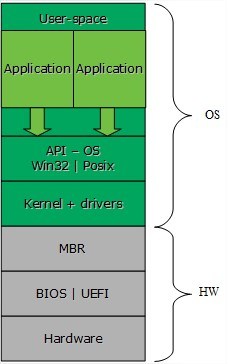
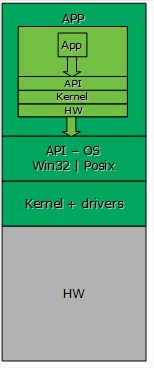
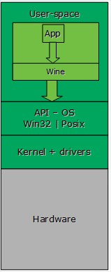
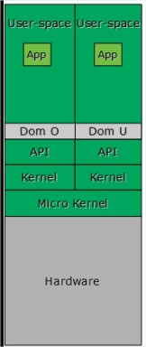
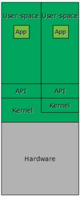
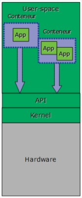

# Acronyme
```
HW : Hardware
US : User Space
K : Kernel
```

# NATIF


# EMULATION


**Avantages :**
- Emulation du hardward
- Plus simple aux devs d'avoir accés au noyau (debug/coder...)

**Inconvénients :**
- Perte de 50% de performances car on passe 2 fois par API+Kernel+HW

***Exemples de logiciels :***
- VirtualBox (sans Hardware)
- VirtualPC
- VMware (sans ESX)

# TRANSLATION


**Avantages :**
- Très peu de perte de performance ( ≈2% )
- On peut éxécuter des apps windows sur un Linux

***Exemples de logiciels :***
- Wine

# ISOLATION


**Avantages :**
- Très peu de perte de performance ( ≈1% )
- Conteneurs (Hardware)

***Exemples de logiciels :***
- VServer
- virtuozzo
- Jail

# HyperV Type1 (Hyperviseur)


**Avantages :**
- De trés bonne performance par rapport à l'émulation ( ≈7% )

***Exemples de logiciels :***
- Xen
- VmWare (ESX)

# HyperV Type2 (Hyperviseur)


***Exemples de logiciels :***
- Kvm

# Conteneur :


**Avantages :**
- Très peu de perte de performance ( ≈1% )

***Exemples de logiciels :***
- Docker
- Rocket
