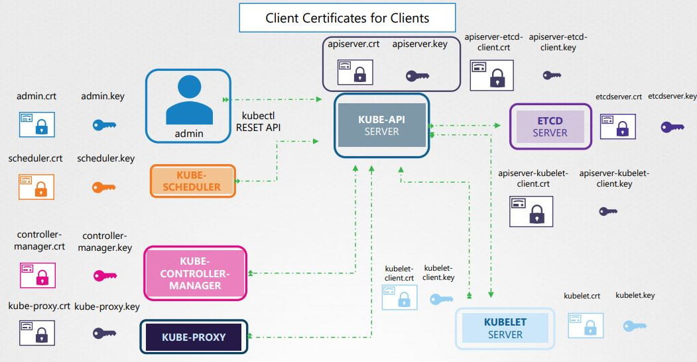
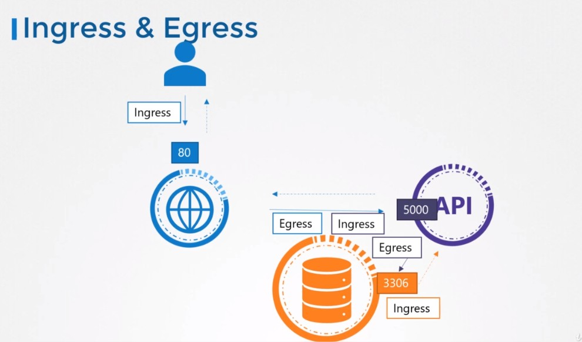
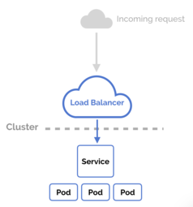
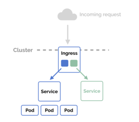

<!-- TOC -->

- [Commandes utiles et prerequis de preparation](#commandes-utiles-et-prerequis-de-preparation)
- [Etat/Fichiers des composants Kubernetes](#etatfichiers-des-composants-kubernetes)
- [Création rapide d'objets Kubernetes](#création-rapide-dobjets-kubernetes)
- [Scheduler](#scheduler)
    - [Nodename](#nodename)
    - [nodeSelector](#nodeselector)
    - [Node Affinity et](#node-affinity-et)
    - [Taints/Tolerances](#taintstolerances)
    - [DaemonSet](#daemonset)
- [Supervision](#supervision)
- [Rolling Updates et Rollbacks](#rolling-updates-et-rollbacks)
- [Cluster Maintenance](#cluster-maintenance)
    - [Upgrade master](#upgrade-master)
    - [Upgrade workers](#upgrade-workers)
- [MEttre le save snapshot](#mettre-le-save-snapshot)
- [Security](#security)
    - [Auth Mechanisms - Basic](#auth-mechanisms---basic)
    - [Les différents certificats](#les-différents-certificats)
    - [Autoriser un utilisateur à se connecter au cluster](#autoriser-un-utilisateur-à-se-connecter-au-cluster)
    - [KubeConfig](#kubeconfig)
    - [RBAC](#rbac)
        - [Role and RoleBinding](#role-and-rolebinding)
        - [ClusterRole](#clusterrole)
        - [Tester les droits](#tester-les-droits)
    - [Registry Docker privé](#registry-docker-privé)
    - [Security Context (Utilisateur et autorisation dans un conteneur/pod)](#security-context-utilisateur-et-autorisation-dans-un-conteneurpod)
    - [Network Policy (Ingress & Egress)](#network-policy-ingress--egress)
- [TLS bootstrapping](#tls-bootstrapping)
- [Stockage](#stockage)
    - [hostPath](#hostpath)
    - [Volume persistant et revendication de volume persistant](#volume-persistant-et-revendication-de-volume-persistant)
- [Réseau](#réseau)
    - [Fichiers de conf](#fichiers-de-conf)
    - [Ingress](#ingress)
- [Json](#json)
- [Conseils](#conseils)
- [Preparation](#preparation)
- [CODE PROMO](#code-promo)

<!-- /TOC -->

# Commandes utiles et prerequis de preparation

- possibilité pendant l'examen de rajouter des favoris dans votre navigateur chrome

- copier le dossier des pods statics afin de faciliter le troubleshooting

  ```shell
  mkdir /mine/master
  mkdir /mine/worker
  cp -r /etc/kubernetes/manifests /mine/master/
  scp -r /etc/kubernetes/manifests /mine/worker/
  ```

- alias

  ```shell
  alias kg='kubectl get'
  alias kd='kubectl describe'
  alias kc='kubectl create'
  alias kdd='kubectl delete'
  alias kcc='kubectl config current-context’
  alias kcu='kubectl config use-context’
  alias kcg='kubectl config get-context'
  ```

- Recherche multiple :

  ```shell
  grep 'word1\|word2\|word3' /path/to/file
  ```

- Récupérer les 3 derniers logs d'un Event :

  ```shell
  kubectl describe pod frontend | grep -A 3 Events
  ```

- vim :

  ```shell
  echo -e "set number\nset tabstop=2" > ~/.vimrc
  u : undo
  ctrl + r : redo
  gg : curseur début de fichier
  Shift + G : Fin de fichier 
  ```

- Vérifier un certificat :

  ```shell
  openssl x509 -in /etc/kubernetes/pki/apiserver.crt -text -noout
  ```

- Si problème sur un master alors vérifier l'état des pods dans le namespace `kube-system` et les logs docker :

  ```docker
  kubectl get pods -n kube-system
  docker logs <container id>
  ```

- Si problème sur un worker alors vérifier les logs kubelet

  ```shell
  journalctl -u kubelet -f
  ```

# Etat/Fichiers des composants Kubernetes

- etcd

  ```shell
  cat /etc/kubernetes/manifests/etcd.yaml
  ps aux | grep etcd
  ```

- kube-api server

  ```shell
  cat /etc/kubernetes/manifests/kube-apiserver.yaml
  ps -aux | grep kube-apiserver
  ```

- Kube Controller Manager

  ```shell
  cat /etc/kubernetes/manifests/kube-controller-manager.yaml
  ps -aux | grep kube-controller-manager
  ```

- Kube Scheduler


  ```shell
  cat /etc/kubernetes/manifests/kube-scheduler.yaml
  ps -aux | grep kube-scheduler
  ```

- Kubelet

  ```shell
  cat /var/lib/kubelet/config.yaml
  ps -aux | grep kubelet
  ```

- Kube-proxy

  ```shell
  kubectl get daemonset -n kube-system
  ```

# Création rapide d'objets Kubernetes

lien : [https://kubernetes.io/fr/docs/reference/kubectl/conventions/](https://kubernetes.io/fr/docs/reference/kubectl/conventions/)


- Pod

  ```shell
  kubectl run --generator=run-pod/v1 nginx --image=nginx --dry-run -o yaml
  ```

- Deployment

  ```shell
  kubectl run --generator=deployment/v1beta1 nginx --image=nginx --dry-run --replicas=4 -o yaml
  ``` 

- Service

  ```shell
  kubectl expose deployment/pod <deployment/pod NAME>
      --name : nom du service
      --type : type du service
      --protocol : protocole à utiliser (TCP/UDP) 
      --port : port utilisé par le service 
      --target-port : port utilisé utilisé par le Pod 
      --selector='clé=valeur': le sélecteur utilisé par service 
  
  --dry-run -o yaml
  ```

# Scheduler

[https://kubernetes.io/docs/concepts/configuration/assign-pod-node/](https://kubernetes.io/docs/concepts/configuration/assign-pod-node/)

## Nodename

```yaml
apiVersion: v1
kind: pod
metadata:
  name: nginx
spec:
  containers:
  - name: nginx
    image: nginx
  nodeName: worker-1
```

## nodeSelector

1. Créer un label d'un pod 

   ```shell
   # Rajouter un moins à la fin pour supprimer le label
   kubectl label node worker-1 ntype=html
   ```

2. Supprimer un label d'un pod 

   ```shell
   kubectl label node worker-1 ntype-
   ```

3. Lister les labels

   ```shell
   kubectl get nodes worker-1 --show-labels
   ```

4. Créer le pod 

   ```yaml
   # ... Pod
   spec:
     nodeSelector:
       ntype: html
   ```


## Node Affinity et 

limiter le placement de pods sur des nœuds spécifiques.

- **During Scheduling** : état où un pod n'existe pas encore
  - **required** : éxige que le pod soit placé sur un nœud respectant les règles d'affinité. Si règle non respecté alors le pod ne sera pas planifié.
  - **preferred** : si aucun nœud n'est trouvé. Le scheduler placera le pod sur n'importe quel autre nœud disponible.
- **During Execution** : état lorsqu'un pod est déjà exécuté, les deux types d’affinité disponibles aujourd’hui sont à l'état ingored, donc les pods continueront à fonctionner sans aucun impact.

```yaml
# ... Pod
spec:
  affinity:
    nodeAffinity:
      requiredDuringSchedulingIgnoredDuringExecution:
        nodeSelectorTerms:
        - matchExpressions:
          - key: ntype
            operator: NotIn
            values:
            - virus
            - malware
```

## Taints/Tolerances

Définir des restrictions sur les pods pouvant être planifiés sur un nœud

1. Mettre une Taint sur un node

   ```shell
   # Rajouter un moins à la fin pour supprimer la Taint
   kubectl taint nodes worker-1 hold=virus:NoSchedule
   kubectl describe node | grep 'Name:\|Taints:'
   ```

   Les types d'effet :
   - **NoSchedule** : le pod ne sera pas programmé sur le nœud marqué par un rejet.
   - **PreferNoSchedule** : évite de placer le pod sur le nœud marqué par un rejet, mais ne le garanti pas.
   - **NoExecute** : si le pod est déjà en cours d'exécution sur le nœud marqué par un rejet, il est alors expulsé.

2. Créer un pod tolérant :

   ```yaml
   # ... Pod
   spec:
     tolerations:
     - key: "hold"
       operator: "Equal"
       value: "virus"
   ```


## DaemonSet

```yaml
apiVersion: apps/v1
kind: DaemonSet
metadata:
  name: nginx-daemonset
spec:
  selector:
    matchLabels:
      app: nginx
  template:
    metadata:
      name: nginx
      labels:
        app: nginx
    spec:
      containers:
      - name: nginx
        image: nginx
```

# Supervision

- Vérifiez l'état/logs du pod de metrics 

  ```shell
  kubectl get po -n kube-system | grep metrics
  kubectl logs metrics-server-77dd877444-hcqrt  -n kube-system
  ```

- Supervision pod et nodes

  ```
  kubectl top nodes
  kubectl top pod
  ```


# Rolling Updates et Rollbacks

- Update

  ```shell
  kubectl run nginx --image=nginx:1.16 --replicas=1 --record
  kubectl rollout status deployment.v1.apps/nginx
  kubectl rollout history deployment.v1.apps/nginx
  kubectl set image deployment.v1.apps/nginx nginx=nginx:1.17 --record=true
  ```


- Rollback

  ```shell
  kubectl rollout undo deployment/myapp-deployment
  ```

# Cluster Maintenance

D'abord un upgrade du master puis un upgrade des workers un par un

***Exemple*** : Upgrade version 1.11 => 1.13, on doit faire un upgrade incrémental par version mineur donc 1.11 => 1.12 => 1.13 

## Upgrade master

1. Vérifier la version possible à upgrade :

  ```shell
  kubeadm upgrade plan
  ```

2. Upgrade de kubeadm puis de kubelet

  ```shell
  apt-get upgrade -y kubeadm=1.12.0-00
  kubeadm upgrade apply v1.12.0
  apt-get upgrade -y kubelet=1.12.0-00
  systemctl restart kubelet
  ```

3. Vérifiez la version version
  
  ```shell
  kubectl get nodes
  ```

## Upgrade workers


1. Rendre le worker unschedulable et déplacez les pods dans un autre worker 

  ```shell
  kubectl drain node1
  ```

2. Upgrade

  ```shell
  apt-get upgrade -y kubeadm=1.12.0-00 && kubelet=1.12.0-00
  kubeadm upgrade node config --kubelet-version v1.12.0
  systemctl restart kubelet
  ```

3. Rendre le pod schedulable
  
  ```shell
  kubectl uncordon node1
  ```

# MEttre le save snapshot


# Security

## Auth Mechanisms - Basic

`/tmp/users/user-details.csv` :

```textile
password123,user1,u0001
password123,user2,u0002
```

/etc/kubernetes/manifests/kube-apiserver.yaml : 

```yaml
spec:
  containers:
  - command:
    - kube-apiserver
    - --basic-auth-file=/tmp/users/user-details.csv
    volumeMounts:
    - mountPath: /tmp/users
      name: usr-details
      readOnly: true
  volumes:
  - hostPath:
      path: /tmp/users
      type: DirectoryOrCreate
    name: usr-details
```

## Les différents certificats




|      Certificate Path               | CN Name | Organization |
|:------------------------------------|---------|--------------|
| /etc/kubernetes/pki/apiserver.(crt/key) | kube-apiserver |
| /etc/kubernetes/pki/ca.(crt/key) | kubernetes |
| /etc/kubernetes/pki/apiserver-kubeletclient.(crt/key) | kube-apiserver-kubelet-client | system:masters |
| /etc/kubernetes/pki/apiserver-etcd-client.(crt/key) | kube-apiserver-etcd-client | system:masters |


## Autoriser un utilisateur à se connecter au cluster

1. Récupérer ou créer le certificat du user à envoyer au serveur api :

   ```shell
   openssl genrsa -out jane.key 2048
   openssl req -new -key jane.key -subj "/CN=jane" -out jane.csr
   ```

2. Créer un CertificateSigningRequest (certificat du user en base 64) :

   ```shell
   cat <<EOF | kubectl apply -f -
   apiVersion: certificates.k8s.io/v1beta1
   kind: CertificateSigningRequest
   metadata:
     name: jane
   spec:
     request: $(cat jane.csr | base64 | tr -d '\n')
     usages:
     - digital signature
     - key encipherment
     - server auth
   EOF
   ```
3. Approuver l'utilisateur :

   ```shell
   kubectl get csr
   kubectl certificate approve jane
   ```

4. Donner à l'utilisateur le fichier ca.crt

## KubeConfig


> Ici on prétend que l'utilisateur possède déjà les droits nécessaires dans le cluster

Sans KubeConfig, il faudrait utiliser les options suivantes dans la commande kubectl 

```textile
kubectl get pods
  --server my-kube-playground:6443
  --client-key admin.key
  --client-certificate admin.crt
  --certificate-authority ca.crt
```

`~/.kube/config`

```yaml
apiVersion: v1
kind: Config
preferences: {}

clusters:
- name: my-kube-playground
  cluster:
    certificate-authority: ca-crt
    # ou la clé en base64
    certificate-authority-data: Y201bGRHVnpNQjRYRFRFNU1Ea3lOVEEzTlRJME1s....
    server: https://my-kube-playground:6443

contexts:
- name: admin@my-kube-playground
  context:
    cluster: my-kube-playground
    user: admin
    # On peut surcharger le namespace par défaut
  
users:
- name: admin
  user:
    client-certificate : admin.crt
    client-key : admin.key
    # ou la clé en base64
    client-certificate-data: LS0tLS1345E
    client-key-data : LSDF345ERFSDF

current-context: admin@my-kube-playground
```

> Vous pouvez plusieurs

```shell
kubectl config view
kubectl config set-context dev-frontend admin@my-kube-playground
```

## RBAC


L'objet rôle est utilisé au niveau du namespace alors qu'un ClusterRole concerne l'ensemble du cluster.

### Role and RoleBinding

**Pas d'options pour --namespace pour les roles**

```shell
kubectl create role pod-reader --verb=get,list,watch --resource=pods 
```

```shell
kubectl create rolebinding user-read-binding --role=pod-reader --user=user-read --namespace=tata
```

### ClusterRole 

```shell
kubectl create clusterrole pod-reader --verb=get,list,watch --resource=pods 
```

```shell
kubectl create rolebinding user-read-binding --clusterrole=pod-reader --user=user-read --namespace=tata
```

### Tester les droits

```shell
kubectl get pod --as dev-user -n tata
yes
kubectl auth can-i create deployments --as dev-user -n tata
no
```

## TLS bootstrapping

1. Create the token

  ```shell
  cat > bootstrap-token-09426c.yaml <<EOF
  apiVersion: v1
  kind: Secret
  metadata:
    # Name MUST be of form "bootstrap-token-<token id>"
    name: bootstrap-token-09426c
    namespace: kube-system
  
  # Type MUST be 'bootstrap.kubernetes.io/token'
  type: bootstrap.kubernetes.io/token
  stringData:
    # Human readable description. Optional.
    description: "The default bootstrap token generated by 'kubeadm init'."
  
    # Token ID and secret. Required.
    token-id: 09426c
    token-secret: x262bbbe835dx21k
  
    # Expiration. Optional.
    expiration: 2021-03-10T03:22:11Z
  
    # Allowed usages.
    usage-bootstrap-authentication: "true"
    usage-bootstrap-signing: "true"
  
    # Extra groups to authenticate the token as. Must start with "system:bootstrappers:"
    auth-extra-groups: system:bootstrappers:node03
  EOF
  
  
  kubectl create -f bootstrap-token-09426c.yaml
  ```

2. enable certificate creation

  ```shell
  kubectl create clusterrolebinding crb-to-create-csr --clusterrole=system:node-bootstrapper --group=system:bootstrappers
  ```

3. Create the kubelet config on the worker node

  ```shell
  cat <<EOF | sudo tee /tmp/bootstrap-kubeconfig
  apiVersion: v1
  clusters:
  - cluster:
      certificate-authority: /etc/kubernetes/pki/ca.crt
      server: https://172.17.0.68:6443
    name: bootstrap
  contexts:
  - context:
      cluster: bootstrap
      user: kubelet-bootstrap
    name: bootstrap
  current-context: bootstrap
  kind: Config
  preferences: {}
  users:
  - name: kubelet-bootstrap
    user:
      token: 09426c.x262bbbe835dx21k
  EOF
  ```

  ```shell
  cat > /etc/systemd/system/kubelet.service <<-EOF
  [Unit]
  Description=Kubernetes Kubelet
  Documentation=https://github.com/kubernetes/kubernetes
  
  [Service]
  ExecStart=/usr/bin/kubelet \
    --bootstrap-kubeconfig=/tmp/bootstrap-kubeconfig \
    --kubeconfig=/var/lib/kubelet/kubeconfig \
    --register-node=true \
    --v=2
  Restart=on-failure
  StandardOutput=file:/var/kubeletlog1.log
  StandardError=file:/var/kubeletlog2.log
  RestartSec=5
  
  [Install]
  WantedBy=multi-user.target
  EOF
  ```

  4. Enable auto approve

  ```shell
  kubectl create clusterrolebinding crb-to-approve-csr --clusterrole=system:certificates.k8s.io:certificatesigningrequests:nodeclient --group=system:bootstrappers
  ```

  5. Enable auto approve

  ```shell
  cat > crb-node-autorotate-csr.yaml <<EOF
  apiVersion: rbac.authorization.k8s.io/v1
  kind: ClusterRoleBinding
  metadata:
    name: crb-autorenew-csr-for-nodes
  subjects:
  - kind: Group
    name: system:nodes
    apiGroup: rbac.authorization.k8s.io
  roleRef:
    kind: ClusterRole
    name: system:certificates.k8s.io:certificatesigningrequests:selfnodeclient
    apiGroup: rbac.authorization.k8s.io
  EOF

  kubectl create -f crb-node-autorotate-csr.yaml
  ```shell


## Registry Docker privé

```shell
kubectl create secret docker-registry regcred --docker-server=<your-registry-server> --docker-username=<your-name> --docker-password=<your-pword> --docker-email=<your-email>
```

```yaml
apiVersion: v1
kind: Pod
metadata:
  name: nginx-pod
spec:
  containers:
  - name: nginx
    image: <your-private-image>
  imagePullSecrets:
  - name: regcred
```

## Security Context (Utilisateur et autorisation dans un conteneur/pod)

```yaml
spec:
  containers:
  - name: ubuntu
    image: ubuntu
    command: ["sleep", "3600"]
    securityContext:
      runAsUser: 1000
      capabilities:
        add: ["SYS_TIME"]
```

## Network Policy (Ingress & Egress)

- Ingress : Connexion entrante
- Egress : Connexion sortante




```yaml
apiVersion: networking.k8s.io/v1
kind: NetworkPolicy
metadata:
  name: test-network-policy
  namespace: default
spec:
  podSelector:
    matchLabels:
      role: db
  policyTypes:
  - Ingress
  ingress:
  - from:
    - podSelector:
        matchLabels:
          role: api-pod
    ports:
    - protocol: TCP
      port: 3306
```

CNI => flannel ne supporte pas les NetworkPolicies

# Stockage

## hostPath

```yaml
spec:
  containers:
  - name: nginx
    image: nginx
    volumeMounts:
    - name: html
      mountPath: /usr/share/nginx/html

  volumes:
  - name: html
    hostPath: 
      path: /data
      type: DirectoryOrCreate
```

## Volume persistant et revendication de volume persistant


```yaml
kind: PersistentVolume
apiVersion: v1
metadata:
   name: my-pv 
spec:
  capacity:
    storage: 1Gi
  accessModes:
    - ReadWriteOnce
  hostPath:
    path: /pv-data
    type: DirectoryOrCreate
```

```yaml
kind: PersistentVolumeClaim
apiVersion: v1
metadata:
   name: my-pvc
spec:
   accessModes:
      - ReadWriteOnce
   resources:
      requests:
        storage: 500Mi
```


```yaml
# Pod
spec:
  containers:
  - name: nginx
    image: nginx
    volumeMounts:
    - name: nginx-pvc
      mountPath: "/usr/share/nginx/html"
  volumes:
  - name: nginx-pvc
    persistentVolumeClaim:
      claimName: my-pvc
```


# Réseau

## Fichiers de conf

- cni

  ```shell
  # Binaire
  ls /opt/cni/bin
  # Fichier de conf
  cat /etc/cni/net.d/net-script.conf
  ```

- Plage ip des pods

  ```shell
  kubectl get pods -n kube-system
  # Une fois que vous avez récupéré le pod cni 
  kubectl logs  -n kube-system <pod-name> <container-name> | grep ipalloc-range
  kubectl logs <pod-name> weave -n kube-system 
  ```

- Plage ip des services

  ```shell
  ps aux | grep ip-range
  ```

- Plage ip des noeuds :

  ```shell
  ip addr
  ```

- CoreDNS

  ```shell
  cat /etc/coredns/Corefile
  ```

- Le type de kube-proxy :

  ```shell
  kubectl logs -n kube-system kube-proxy-2dgr9 | grep 'ipvs\|userspace\|firewalld\|iptables'
  ```

> le fichier `/etc/hosts` prend le dessus sur le fichier `/etc/resolv.conf`

## Ingress





```shell
kubectl apply -f https://raw.githubusercontent.com/kubernetes/ingress-nginx/master/deploy/static/mandatory.yaml
kubectl get pods --all-namespaces -l app=ingress-nginx
```

```yaml
kind: Pod
apiVersion: v1
metadata:
  name: apple-app
  labels:
    app: apple
spec:
  containers:
    - name: apple-app
      image: hashicorp/http-echo
      args:
        - "-text=apple"

---
# banana-app

---
kind: Service
apiVersion: v1
metadata:
  name: apple-service
spec:
  selector:
    app: apple
  ports:
    - port: 5678


---
# banana-service
```

```yaml
apiVersion: extensions/v1beta1
kind: Ingress
metadata:
  name: example-ingress
  annotations:
    ingress.kubernetes.io/rewrite-target: /
spec:
  rules:
  - http:
      paths:
        - path: /apple
          backend:
            serviceName: apple-service
            servicePort: 5678
        - path: /banana
          backend:
            serviceName: banana-service
            servicePort: 5678
```


```shell
curl -kL http://localhost/apple
apple

curl -kL http://localhost/banana
banana

curl -kL http://localhost/notfound
default backend - 404
```

# Json

[https://kubernetes.io/fr/docs/reference/kubectl/cheatsheet/](https://kubernetes.io/fr/docs/reference/kubectl/cheatsheet/)

- Récupérer l'image du premier conteneur de toutes les images

  ```shell
  kubectl get pods -o jsonpath='{.items[*].spec.containers[0].image}'
  ```

- Récupérer le nom du node et la capacité cpu avec un saut à la ligne

  ```shell
  kubectl get nodes -o jsonpath='{.items[*].metadata.name}{"\n"}{.items[*].status.capacity.cpu}'
  ```
  Résultat :
  
  ```textile
  master node01
  4      4
  ```

- Les boucles

  ```shell
  kubectl get nodes -o jsonpath='{range .items[*]}{.metadata.name}{"\t"}{.status.capcity.cpu}{\"n"}{end}'
  ```
  Résultat :
  
  ```textile
  master  4
  node01  4
  ```
  
- Trier les PVs en ordre croissant seulon leur capacité de stockage et n'afficher que le nom et la capacité de stockage sous forme de colonnes 

  ```shell
  kubectl get pv --sort-by=.spec.capacity.storage  -o=custom-columns=NAME:.metadata.name,CAPACITY:.spec.capacity.storage
  ```

  ```textile
  NAME       CAPACITY
  pv-log-4   40Mi
  pv-log-1   100Mi
  pv-log-2   200Mi
  pv-log-3   300Mi
  ```

- Obtenir le nom context du user "aws-user"

  ```shell
  kubectl config view --kubeconfig=my-kube-config -o jsonpath="{.contexts[?(@.context.user=='aws-user')].name}"
  ```


# Conseils

- TOUJOURS vérifier sur quel cluster vous êtes car l'exam se déroule sur plusieurs clusters
- Hiérarchiser les questions car les questions sont indépendantes et n’ont pas non plus le même coefficient donc ne pas hésiter à privilégier les questions faciles qui rapportent

# Preparation

Exercice/Doc : 

- [https://github.com/dgkanatsios/CKAD-exercises](https://github.com/dgkanatsios/CKAD-exercises)
- [https://github.com/arush-sal/cka-practice-environment](https://github.com/arush-sal/cka-practice-environment)
- [https://github.com/walidshaari/Kubernetes-Certified-Administrator](https://github.com/walidshaari/Kubernetes-Certified-Administrator)


# CODE PROMO

Coupoun : DCUBEOFFER
