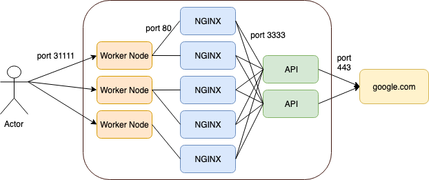

### Test 1

1. Create a deployment named nginx-deployment of three pods running image nginx with a memory limit of 200MB.
2. Expose this deployment under the name nginx-service inside our cluster on port 4444, so point the service port 4444 to pod ports 80.
3. Spin up a temporary pod named pod1 of image hajdaini/alpine, and request the default nginx page on port 4444 of our nginx-service using curl.
4. Spin up a temporary pod named pod2 of image hajdaini/alpine in namespace test1, and request the default nginx page on port 4444 of our nginx-service .

```shell
kubectl run --generator=deployment/v1beta1 nginx-deployment --image=nginx --replicas 3 --limits='memory=200Mi'
kubectl expose deployment nginx-deployment --type=ClusterIP --name=nginx-service --port=4444 --target-port=80

## HTTP code 200
kubectl run --generator=run-pod/v1 pod1 --image=hajdaini/alpine:curl -ti --rm --  http://nginx-service:4444

# HTTP code 404 because different namespace
kubectl create namespace test1
kubectl run --generator=run-pod/v1 pod2 --namespace=test1 --image=hajdaini/alpine:curl -ti --rm --  http://nginx-service:4444
```

### Test 2

1. Create a static PersistentVolume of 50MB with the path *tmp/test2*.
2. Create a PersistentVolumeClaim for this volume for 40MB.
3. Create a CronJob which runs two instances every minute of: a pod mounting the PersistentStorageClaim into /tmp/vol and executing the command `echo "`date +'%H-%S.txt'`" >> /tmp/vol/storage`. (We only need to keep the last 4 successful executed jobs in the cronjob history.)
4. Check your local filesystem for the hostnames of these pods with tail -f /tmp/k8s-challenge-3/storage.


```yaml
apiVersion: v1
kind: PersistentVolume
metadata:
  name: test2-pv
spec:
  capacity:
    storage: 50Mi
  accessModes:
    - ReadWriteOnce
  hostPath:
    path: /tmp/test2
    type: DirectoryOrCreate

---
apiVersion: v1
kind: PersistentVolumeClaim
metadata:
  name: test2-pvc
spec:
  accessModes:
    - ReadWriteOnce
  resources:
    requests:
      storage: 40Mi

---
apiVersion: batch/v1beta1
kind: CronJob
metadata:
  name: hello
spec:
  schedule: "*/1 * * * *"
  successfulJobsHistoryLimit: 4
  jobTemplate:
    spec:
      parallelism: 2
      template:
        spec:
          containers:
          - name: hello
            image: bash
            args:
            - bash
            - -c
            - echo "`date +'%H-%S.txt'`" >> /tmp/vol/storage
          restartPolicy: OnFailure
            volumeMounts:
            - mountPath: "/tmp/vol"
              name: test2-pvc
          volumes:
            - name: test2-pvc
              persistentVolumeClaim:
                claimName: test2-pvc
```

```shell
ssh root@node01 cat /tmp/test2/storage
```

### Test 3


1. Create a deployment of 3 pods with image nginx:1.14.2.
2. Confirm that all pods are running that image.
3. Edit the deployment to change the image of all pods to nginx:1.15.10.
4. Confirm that all pods are running image nginx:1.15.10.
5. Edit the deployment to change image of all pods to nginx:1.15.666.
6. Confirm that all pod are running image nginx:1.15.666 and have no errors. Show error if there is one.
7. Woops! Something went crazy wrong here! Rollback the change, so all pods should run nginx:1.15.10 again.
8. Confirm that all pods are running image nginx:1.15.10.


```shell
kubectl run nginx --image=nginx:1.14.2 --replicas=3
kubectl get pods -o=custom-columns=NAME:.metadata.name,IMAGE:.spec.containers[0].image
kubectl set image deployment.v1.apps/nginx nginx=nginx:1.15.10 --record=true
kubectl set image deployment.v1.apps/nginx nginx=nginx:1.15.666 --record=true
kubectl rollout history deployment.v1.apps/nginx
kubectl rollout undo deployment.v1.apps/nginx --to-revision=1
kubectl get pods -o=custom-columns=NAME:.metadata.name,IMAGE:.spec.containers[0].image
```


### Test 4

1. Create secret1 and store password:12345678.
2. Create a pod-secret-secret.yaml which creates a single pod of image bash . This pod should mount the secret1 to /tmp/secret1. This pod should stay idle after boot.
3. Confirm pod1 has access to our password via file system.
4. On your local machine (master node) create a folder drinks and its content: `mkdir drinks; echo ipa > drinks/beer; echo red > drinks/wine; echo sparkling > drinks/water`
5. Create a ConfigMap containing all files of folder drinks and their content.
6. Make these ConfigMaps available in a pod-configmap using environment variables.
7. Check on pod-configmap if those environment variables are available.


```shell
kubectl create secret generic secret1 --from-literal=password=12345678
mkdir drinks; echo ipa > drinks/beer; echo red > drinks/wine; echo sparkling > drinks/water
kubectl create configmap drinks --from-file=drinks/
```


```yaml
apiVersion: v1
kind: Pod
metadata:
  name: pod-secret
spec:
  volumes:
  - name: secret1
    secret:
      secretName: secret1
  containers:
  - name: pod-secret
    image: bash
    command:
    args: ["sleep", "3000"]
    volumeMounts:
    - name: secret1
      mountPath: "/tmp/secret1"

---
apiVersion: v1
kind: Pod
metadata:
  name: pod-configmap
spec:
  containers:
  - name: pod-secret
    image: bash
    command:
    args: ["sleep", "3000"]
    envFrom:
    - configMapRef:
        name: drinks
```

```shell
kubectl exec pod-configmap -ti  -- env
kubectl exec pod-secret -ti  -- cat /tmp/secret1/password && echo ""
```

### Test 5


**Before** :

Launch command bellow : 

```shell
kubectl create -f https://raw.githubusercontent.com/wuestkamp/k8s-challenges/master/6/scenario.yaml
```

**The objects**

- deployment `nginx-deployment` with 5 replicas, nginx on port 80
- deployment `api-deployment` with 2 replicas, simple service running port 3333
- NodePort service `nginx-service` which exposes port 31111 on each node and forwards to port 80 on the nginx pods
- ClusterIP service `api-service` to handle simple internal load balancing from nginx instances to api instances on port 3333




**Questions**

- implement a NetworkPolicy for nginx pods to only allow egress to the internal api pods on port 3333. No access to the outer world (but DNS).
- implement a NetworkPolicy for api pods to only allow ingress on port 3333 from the internal nginx pods. To test negative: check from api to api.
- implement a NetworkPolicy for api pods to only allow egress to (IP of google.com) port 443.


```yaml
apiVersion: networking.k8s.io/v1
kind: NetworkPolicy
metadata:
  name: np-nginx
spec:
  podSelector:
    matchLabels:
      app: nginx
  policyTypes:
  - Egress
  egress:
  - to:
    - podSelector:
        matchLabels:
          app: api
    ports:
    - protocol: TCP
      port: 3333

---
apiVersion: networking.k8s.io/v1
kind: NetworkPolicy
metadata:
  name: np-api
spec:
  podSelector:
    matchLabels:
      app: api
  policyTypes:
  - Ingress
  - Egress
  ingress:
  - from:
    - podSelector:
        matchLabels:
          app: nginx 
    ports:
    - protocol: TCP
      port: 3333
  egress:
  - to:
    - ipBlock:
        cidr: 216.58.208.35/32
    ports:
      - port: 443
        protocol: TCP
```


### Test 6


1. Create a deployment called compute of three replicas of image byrnedo/alpine-curl which keep running for a while. Make sure they can reach our external service: curl www.google.com:80
2. Create an ExternalName service called webapi which points to www.google.com. Make sure our pods can reach the service with nslookup.

```shell
kubectl run compute --image=byrnedo/alpine-curl --replicas=3 --dry-run -o yaml -- sleep 3000
kubectl exec compute-777f85d55-8crfc -- curl  www.google.com
kubectl create service externalname webapi --external-name www.google.com
kubectl exec compute-777f85d55-8crfc -- nslookup webapi
```
