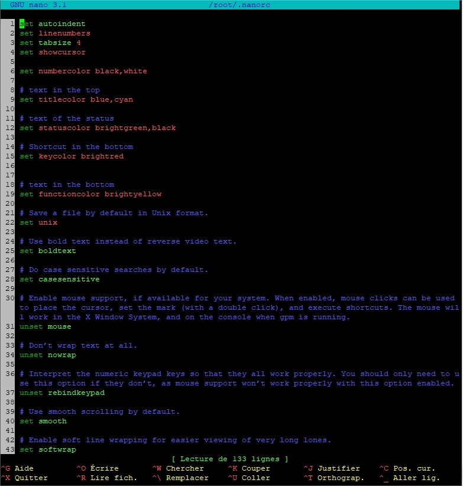

# Compilation nano

## Pré-requis

**Supprimer la version actuelle de nano !**

## Install

Lien de téléchargement de nano : https://www.nano-editor.org/download.php

```shell 
wget http://lien/ nano-x.y.z.tar.gz 
tar -zxvf nano-x.y.z.tar.gz
``` 

- **centos :**

  ```shell 
  yum install gcc ncurses-devel
  ``` 

- **debian :**

  ``` shell
  apt-get install gcc libncurses5-dev
  ``` 

  ```shell
  cd nano-x.y.z/
  ./configure --prefix=/usr
  make
  make install
  ``` 

### Config :

- Renommer le fichier de config **nanorc** en **.nanorc** et le mettre dans *~/*

  ```shell
  mv nanorc ~/.nanorc
  ```

- Dezipper et deplacer les fichiers de coloration syntaxique de **nano.zip** dans */usr/share/nano/*

  ```shell
  cd /usr/share/nano/
  rm -f *.nanorc
  wget <lien>
  unzip nano.zip
  cd nano && mv * ..
  ```

### Problème :

C'est possible d'avoir l'erreur suivante : 

```shell
nano test.txt
-bash: /bin/nano: No such file or directory
```

Il suffit de recopier le fichier les binaires de nano :

```shell
cp /usr/bin/nano /bin/
```

### Inspiration et Doc :

- Fichier de config : https://manpages.debian.org/unstable/nano/nanorc.5.en.html 
- Coloration syntaxique : https://github.com/scopatz/nanorc 
 
### Screenshot


